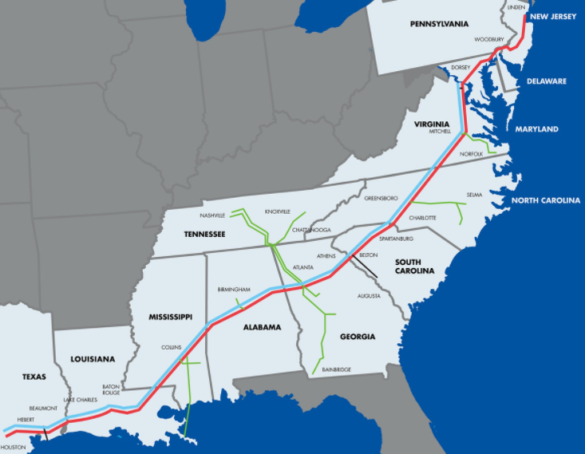
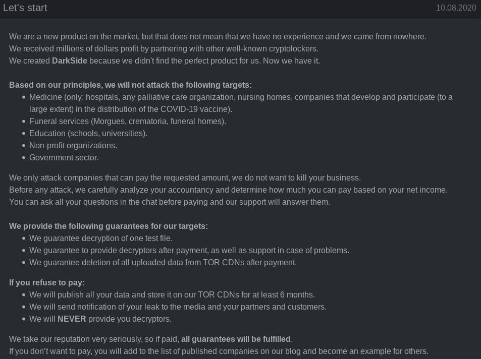
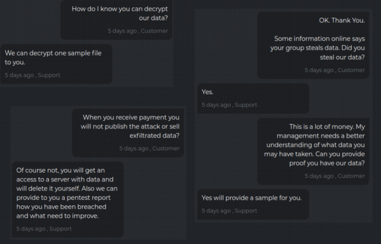

# Colonial Pipeline cyber attack

- Name: Aravinth TM
- Registration Number: 19BCE7415

Supervisory control And Data Acquisition(SCADA) systems monitor and
control infrastructure like nuclear power plants, municipal drinking
water systems, gas pipelines and power grids. They are notorious for
running outdated, vulnerable software and are easy targets for cyber
criminals.

On May 7, 2021, an American oil pipeline system situated in Houston,
Texas came under a ransomware attack. It's responsible for ferrying gas
and jet fuel to Southeastern parts of the US. The Colonial Pipeline
Company company paid the 75 bitcoin ransom to restore operations of the
pipeline. This amount was partially recovered after the criminal group
called DarkSide's servers were seized.

It is believed that the attacker stole 100 GB of data from company
servers before the attack.

## Impact

The company's payment infrastructure was compromised while the
operational technology systems remained functional. Due to this, the
company wasn't able to process payments so they decided to halt the
pipeline operation.

A fuel shortage situations resulted in airports that were serviced by
the pipeline company several airline companies had to change their
flight schedule.

Average fuel prices rose to their highest since 2014, reaching more than
$3 a gallon.

> Colonial Pipeline coverage

This cyber attack is very new and forensics are just getting started.
The rest of the report will focus on how DarkSide functions.

## DarkSide's modus operandi

- DarkSide's doesn't have a nation state backing them, they are a
  randomware gang.

- They are apolitical: their actions are monetary rewards

- Their behaviour is inline with other ransomware gangs: 1. They encrypt their victims data 2. They steal their victims data
  And hold their victims ransom for both of them in different stages and
  there by committing double extortion.

  

  > DarkSide philosophy

- The DarkSide core team is believed to be originated from an othe
  ransomeware gang called "REvil" so they share similar modus operandi

DarkSide infrastructure's and modus operandi is sophisticated. They have
dedicated support teams and payment systems.

> DarkSide support team

They also take part "ransomware as a service", which as the name
suggests, helps other cyber criminal groups to offload certain aspects
of the attack to ransomware specialists. This offering includes:

- customer support for both the victim and the criminal group
- payments gateway access with money laundering capabilities
- Tor based CDNs to distribute stolen data.

DarkSide also claims to be "growing" and as a result is looking to
contract independent cyber criminals to assist them with their criminal
endeavours.

> ### Job listing:
>
> “There is huge insider information on the companies which we target,
> including information if there are tape drives and clouds (for
> example, Datto that is built to last, etc.), which significantly
> affects the scale of the conversion rate.
>
> Requirements: – experience with cloud storage, ESXi. – experience with
> Active Directory. – privilege escalation on accounts with limited
> rights.
>
> - Serious level of insider information on the companies with which we
>   work. There are proofs of large payments, but only for verified
>   LEADs.
> - There is also a private MEGA INSIDE , which I will not write about
>   here in public, and it is only for experienced LEADs with their
>   teams.
> - We do not look at REVENUE / NET INCOME / Accountant reports, this is
>   our MEGA INSIDE, in which we know exactly how much to confidently
>   squeeze to the maximum in total

Earlier, a cyber criminal's activities can be tracked with the money
trail that they leave behind or their unique signature in the way they
interact with the world but the trade of expertise among cyber
criminals will both increase the lethality of cyber attacks and
eliminate traditional avenues of forensic investigation. This is going
to become characteristic of future cyber attacks.

## How to protect against ransomware attacks?

1. SCADA systems should be isolated: systems that don't require a
   network to function should be taken off the network.

2. Use VPNs to implement access control: Access control is hard to
   implement. Private companies already follow this mechanism to isolate
   their private infrastructure from the larger internet. Rather than
   rolling out their own access control mechanism, they offload it to
   standardised VPN software like Wireguard, which offers
   cryptographically sound and fine grained access control mechanisms.

3. Regular backups: Post infection, ransom payment can be avoided if the
   organisation has current, functional backups. They could simple wipe
   their systems clean and restore it from backups.

4. Policy creation: policies must be created beforehand to deal with
   data leaks, ransomware attacks and other kinds of security breaches
   so first responders will have a framework to work from. This results
   in a more effective response that is well organised.
